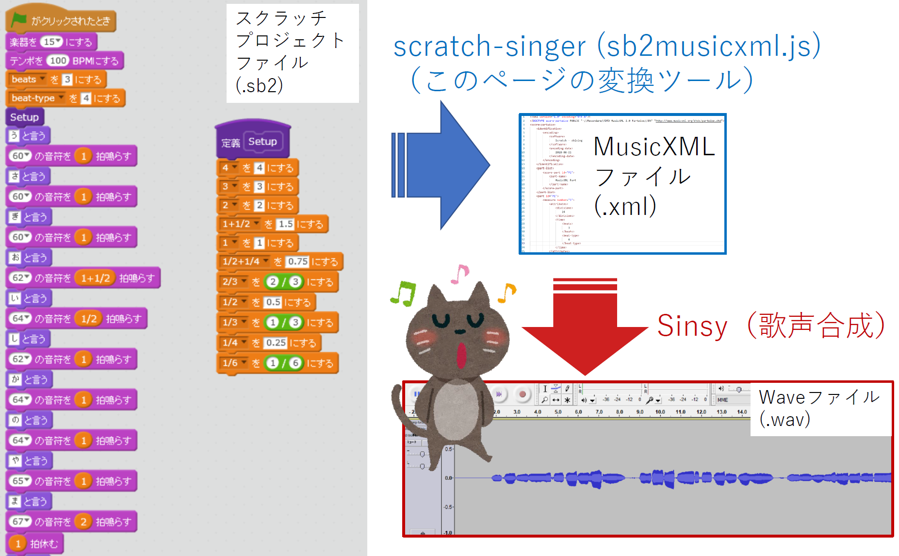

[(Japanese)](index.md)

# Convert Scratch 2 Project File to a MusicXML for Singing Voice Synthesis

Upload your scratch project (.sb2) <svg style="width:1em; height:1em"><use xlink:href="symbol-defs.svg#icon-upload"></use></svg>

<a name="uploadfile">
<input type="file" id="infile" name="f">

    
<b>Success!</b>

    <ol>
        <li><a href="#" id="dl">Download MusicXML (song.xml) <svg style="width:1em; height:1em"><use xlink:href="symbol-defs.svg#icon-download"></use></svg></a></li>
        <li><a href="http://www.sinsy.jp/" target="_blank">Open Sinsy page</a></li>
    </ol>

## What is this script?

- This script converts a scratch project file (.sb2) to a MusicXML file (song.xml).
- The generated xml file can be used as an input to [Sinsy (Singing Voice Synthesis)](http://www.sinsy.jp/).
- Demo
    1. [Original scratch project file (song-furusato.sb2)](sb2/song-furusato.sb2) [(Check with scratch online editor)](https://scratch.mit.edu/projects/239680094/)
    1. [Converted MusicXML (song.xml)](test/song.xml)
    1. [Synthesized singing voice by Sinsy (song-furusato.wav) <svg style="width:1em; height:1em"><use xlink:href="symbol-defs.svg#icon-music"></use></svg>](test/song-furusato.wav)

## How to use

1. Create a scratch project like [this sample project](https://scratch.mit.edu/projects/240260846/). **Note that the name of the sprite needs to be "song".**
    - Scratch offline editor can also be used after downloading sb2 file.
1. Save/download the scratch project as a sb2 file.
1. Click [the button at the top of this page](#uploadfile) and upload your scratch project (sb2) file.
1. Download a generated XML file (song.xml).
1. Upload the xml file to [Sinsy (Singing Voice Synthesis)](http://www.sinsy.jp/).
1. Download or play the generated wave file.

## Required files for local use

Download the following files from [Download Zip] and save in the same folder.
- sb2musicxml.html
- sb2musicxml.js
- jszip.min.js

## Synthesized examples by Sinsy

- [test/song-homesweethome.wav <svg style="width:1em; height:1em"><use xlink:href="symbol-defs.svg#icon-music"></use></svg>](test/song-homesweethome.wav)
    - [Source scratch project (online)](https://scratch.mit.edu/projects/239680350/)
    - [Source scratch project (sb2 file)](sb2/song-homesweethome.sb2)
- [test/song-furusato.wav <svg style="width:1em; height:1em"><use xlink:href="symbol-defs.svg#icon-music"></use></svg>](test/song-furusato.wav)
    - [Source scratch project (online)](https://scratch.mit.edu/projects/239680094/)
    - [Source scratch project (sb2 file)](sb2/song-furusato.sb2)
- [test/timing-test-homesweethome.sb2](test/timing-test-homesweethome.sb2) combines a generated wave file and the original scratch project and plays simultaneously. You can find that scratch script is slower than wave file. To synchronize precisely, it might be better to use timer in scratch script.

## TODO

- Increase the type of notes (duration).
- Support sb3 (Scratch 3 project file).

## License

- MIT License
- jszip.min.js is from https://stuk.github.io/jszip/.