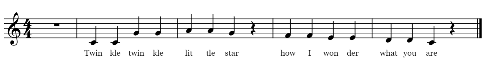
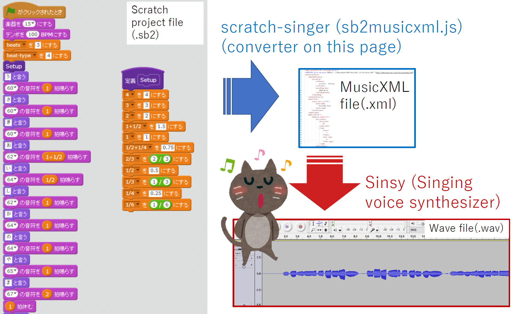

[(Japanese)](index.md)

# Convert a Scratch Project File to a MusicXML for Singing Voice Synthesis

<label for="infile" class="button">
    Upload a scratch project (.sb2) <svg class="icon"><use xlink:href="symbol-defs.svg#icon-upload"></use></svg>
    <input type="file" id="infile" name="f">
</label>
<input type="text" id="filename" placeholder="" readonly>

    
<b>Success!</b>

    <ol>
        <li><a href="#" id="dl-xml" class="button">Download MusicXML (song.xml) <svg class="icon"><use xlink:href="symbol-defs.svg#icon-download"></use></svg></a></li>
        <li><a href="http://www.sinsy.jp/" target="_blank">Open Sinsy page <svg class="icon"><use xlink:href="symbol-defs.svg#icon-new-tab"></use></svg></a></li>
    </ol>

## What does this tool do?

- This script converts a scratch project file (.sb2) to a MusicXML file (song.xml).
- The generated xml file can be used as an input to [Sinsy (Singing Voice Synthesis)](http://www.sinsy.jp/).
- Demo
    1. [Original scratch project file (song-twinkletwinkle.sb2)](sb2/song-twinkletwinkle.sb2)  <a href="https://scratch.mit.edu/projects/242023675/" target="_blank">(Open with Scratch 2.0 online<svg class="icon"><use xlink:href="symbol-defs.svg#icon-new-tab"></use></svg>)</a>
    1. [Converted MusicXML (song.xml)](test/song-twinkletwinkle.xml)
    1. [Synthesized singing voice by Sinsy (song-twinkletwinkle.wav) <svg class="icon"><use xlink:href="symbol-defs.svg#icon-music"></use></svg>](test/song-furusato.wav)

## How to use

Let's synthesize vocal part of "Twinkle twinkle little star" using the following score. We code the second measure and after. When the first note is not a rest, an empty measure with a rest will be automatically inserted at the beginning.

### Step 1. Prepare a scratch project file (.sb2)

1. Create a scratch project with lyrics and a melody line. You can refer to or copy <a href="https://scratch.mit.edu/projects/242023675/" target="_blank">a sample project here<svg class="icon"><use xlink:href="symbol-defs.svg#icon-new-tab"></use></svg></a>.
    - **Note that the name of the sprite needs to be "song".**
    - Use a pair of "Say ..." and "play note ... for ... beats" for a sound.
    - Use "rest for ... beats" for a rest.
    - Use preset variables for duration.
    - Use hyphen to connect multiple syllables.
        - "twin-" + "kle"
        - "lit-" + "tle"
        - "won-" + "der"
    - One note cannot cross over a bar line between measures.
1. Save/download the scratch project as a sb2 file.
    - Scratch offline editor can also be used after downloading sb2 file.

### Step 2. Convert the scratch project file (.sb2) to MusicXML (.xml)

1. Click [the button at the top of this page](#uploadfile) and upload your scratch project (sb2) file.
1. Download a generated XML file (song.xml).

### Step 3. Input the MusicXML file to Sinsy

1. Upload the xml file to [Sinsy (Singing Voice Synthesis)](http://www.sinsy.jp/).
1. Download or play the generated wave file.

## Required files for local use

Download the following files from [Download Zip] and save in the same folder.
- sb2musicxml.html
- sb2musicxml.js
- jszip.min.js

## Synthesized examples by Sinsy

1. [test/song-homesweethome.wav <svg class="icon"><use xlink:href="symbol-defs.svg#icon-music"></use></svg>](test/song-homesweethome.wav)
    - <a href="https://scratch.mit.edu/projects/239680350/" target="_blank">Source scratch project (online<svg class="icon"><use xlink:href="symbol-defs.svg#icon-new-tab"></use></svg></a>) (generated from Japanese lyrics)
    - [Source scratch project (sb2 file)](sb2/song-homesweethome.sb2)
1. [test/song-furusato.wav <svg class="icon"><use xlink:href="symbol-defs.svg#icon-music"></use></svg>](test/song-furusato.wav)
    - <a href="https://scratch.mit.edu/projects/239680094/" target="_blank">Source scratch project (online<svg class="icon"><use xlink:href="symbol-defs.svg#icon-new-tab"></use></svg></a>) (generated from Japanese lyrics)
    - [Source scratch project (sb2 file)](sb2/song-furusato.sb2)
    <iframe width="560" height="315" src="https://www.youtube.com/embed/3BSUuTnjvVU?rel=0" frameborder="0" allow="autoplay; encrypted-media" allowfullscreen></iframe>
    - [Lip sync with generated wave file (.sb2)](test/lipsync-singing.sb2) <a href="https://scratch.mit.edu/projects/244083954/" target="_blank">(Open with Scratch 2.0 online<svg class="icon"><use xlink:href="symbol-defs.svg#icon-new-tab"></use></svg>)</a> <a href="https://beta.scratch.mit.edu/#244083954" target="_blank">(Open with 3.0beta<svg class="icon"><use xlink:href="symbol-defs.svg#icon-new-tab"></use></svg>)</a>
    - Currently, a list file for lip sync is generated only from [Japanese version/lyrics](index.md).
1. <a href="https://scratch.mit.edu/projects/242364573/" target="_blank">Sing "Happy birthday" with four sprites (online<svg class="icon"><use xlink:href="symbol-defs.svg#icon-new-tab"></use></svg></a>) (generated from Japanese lyrics)
    - <a href="https://scratch.mit.edu/projects/242273933/" target="_blank">Scratch project for singing voice synthesis<svg class="icon"><use xlink:href="symbol-defs.svg#icon-new-tab"></use></svg>
    <iframe width="560" height="315" src="https://www.youtube.com/embed/VCJcj3ZZ6Jo?rel=0" frameborder="0" allow="autoplay; encrypted-media" allowfullscreen></iframe>
    - <a href="https://scratch.mit.edu/projects/243360901/" target="_blank">Combination with candle blowout<svg class="icon"><use xlink:href="symbol-defs.svg#icon-new-tab"></use></svg></a>; this project utilizes [seq2sprite](https://memakura.github.io/seq2sprite/).
    <iframe width="560" height="315" src="https://www.youtube.com/embed/95dDLoJVVFg?rel=0" frameborder="0" allow="autoplay; encrypted-media" allowfullscreen></iframe>

## TODO

- Support sb3 (Scratch 3 project file).

## License

- MIT License
- jszip.min.js is from https://stuk.github.io/jszip/.

## Appendix: Synchronization Test

1. [test/timing-test-homesweethome.sb2](test/timing-test-homesweethome.sb2)
    - Combines a generated wave file and the original scratch project and plays simultaneously.
    - You can find that "song" sprite is slower than wave file.
    - To synchronize precisely, it might be better to use timer in a scratch script.
1. [test/timing-test-furusato.sb2](test/timing-test-furusato.sb2)
    - In "song" sprite, variable "beginning-silent-duration" is used to adjust start timing. However, "Song" sprite has some delay especially when many blocks exist.
    - Sprite "Giga" uses "timer". So it is synchronized precisely with the song (wave file).
