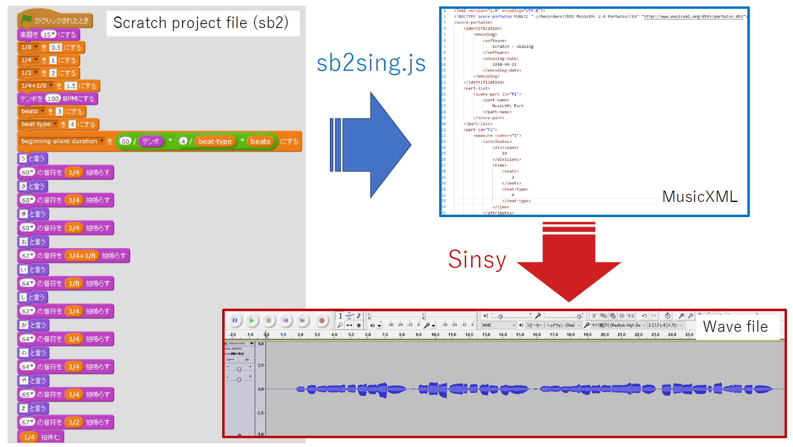

[(English)](#English)

# スクラッチのプロジェクトファイルを歌声合成の入力ファイルに変換する

- スクラッチのプロジェクトファイル (sb2) を MusicXML へ変換します。
- 変換された MusicXML ファイルは [Sinsy (Singing Voice Synthesis)](http://www.sinsy.jp/) などの歌声合成ツールの入力に使えます。
- デモ
    1. [元のスクラッチプロジェクト (song-furusato.sb2)](sb2/song-furusato.sb2) / [オンラインエディタで確認](https://scratch.mit.edu/projects/239680094/)
    1. [変換して出来た MusicXML (song.xml)](test/song.xml)
    1. [Sinsyによる歌声合成結果 (song-furusato.wav)](test/song-furusato.wav)

## 必要なファイル（以下のファイルは同じフォルダに入れておきます）
- sb2sing.html
- sb2sing.js
- jszip.min.js

## 使い方

1. [sb2/song-homesweethome.sb2](sb2/song-homesweethome.sb2)や[sb2/song-furusato.sb2](sb2/song-furusato.sb2)を参考にスクラッチで曲を作り、プロジェクトファイルを保存します。**（重要！）このとき、スプライトの名前を「song」にしておきます。**
1. sb2sing.html をブラウザで開きます。
1. ボタンを押して、作成したスクラッチのプロジェクトファイル（sb2という拡張子）をアップロードします。
1. 変換されたXMLファイル（xmlという拡張子）をダウンロードします。
1. ダウンロードしたXMLファイルを[Sinsy (Singing Voice Synthesis)](http://www.sinsy.jp/)にアップロードします。

## Sinsyと組み合わせた合成例

- [test/song-homesweethome.wav](test/song-homesweethome.wav)
- [test/song-furusato.wav](test/song-furusato.wav)
- [test/timing-test-homesweethome.sb2](test/timing-test-homesweethome.sb2) では曲を作った時のスクラッチプロジェクトに、合成された歌声を合わせて同時に再生しています。スクラッチのスクリプトの方が遅れてくるため、同期させるのであればおそらくスクラッチスクリプト内でタイマーを使ったほうがよいでしょう。

## TODO

- 音符の種類を増やす
- スクラッチ3のプロジェクトファイル (sb3) のサポート
- タイミングリストの出力（スクラッチで再度利用するため）

## ライセンス

- MITライセンス
- jszip.min.js は https://stuk.github.io/jszip/ を利用しています。

<a name="English">

# Convert Scratch 2 Project File to a MusicXML for Singing Voice Synthesis

- This script convert a scratch project file (sb2) to a MusicXML file (song.xml).
- The generated xml file can be used as an input to [Sinsy (Singing Voice Synthesis)](http://www.sinsy.jp/).
- Demo
    - [Original scratch project file (song-furusato.sb2)](sb2/song-furusato.sb2) / [Check with online editor](https://scratch.mit.edu/projects/239680094/)
    - [Converted MusicXML (song.xml)](test/song.xml)
    - [Synthesized singing voice by Sinsy (song-furusato.wav)](test/song-furusato.wav)

## Required files (download the following files to the same folder)
- sb2sing.html
- sb2sing.js
- jszip.min.js

## How to use

1. Create a scratch project (See [sb2/song-homesweethome.sb2](sb2/song-homesweethome.sb2) and [sb2/song-furusato.sb2](sb2/song-furusato.sb2) for example). **Note that the name of the sprite needs to be "song".**
1. Open sb2sing.html by a browser.
1. Click the button and upload your scratch project (sb2) file.
1. Download a generated XML file (song.xml).
1. Upload the xml file to [Sinsy (Singing Voice Synthesis)](http://www.sinsy.jp/).

## Synthesized examples by Sinsy

- [test/song-homesweethome.wav](test/song-homesweethome.wav)
- [test/song-furusato.wav](test/song-furusato.wav)
- [test/timing-test-homesweethome.sb2](test/timing-test-homesweethome.sb2) combines a generated wave file and the original scratch project and plays simultaneously. You can find that scratch script is slower than wave file. To synchronize precisely, it might be better to use timer in scratch script.

## TODO

- Increase the type of notes (duration).
- Support sb3 (Scratch 3 project file).

## License

- MIT License
- jszip.min.js is from https://stuk.github.io/jszip/.