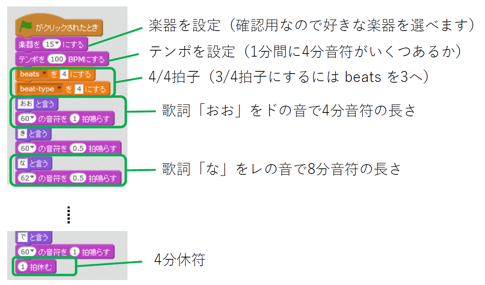
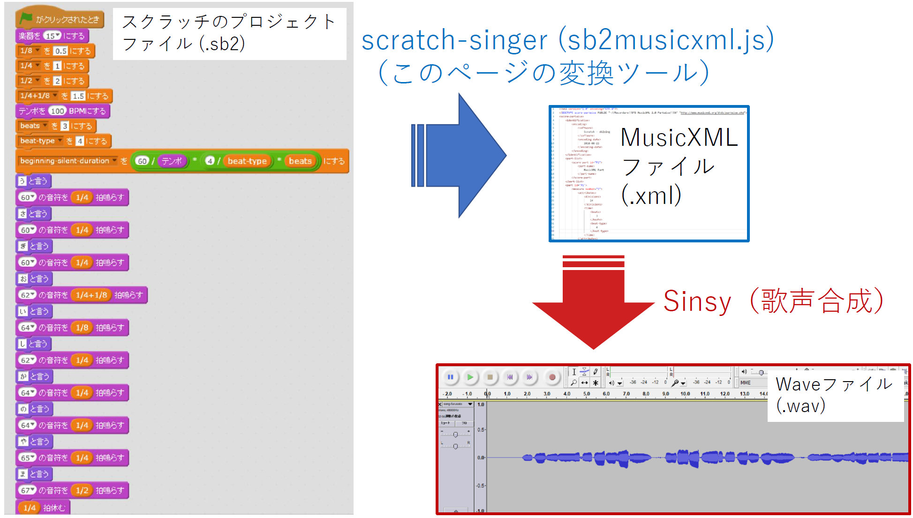

[(English)](index-en.md)

# スクラッチのプロジェクトファイルを歌声合成の入力ファイルに変換する

<label for="infile" class="button">
    スクラッチプロジェクト(.sb2)をアップロード <svg class="icon"><use xlink:href="symbol-defs.svg#icon-upload"></use></svg>
    <input type="file" id="infile" name="f">
</label>
<input type="text" id="filename" placeholder="" readonly>

    
<b>変換成功！</b>

    <ol>
        <li><a href="#" id="dl-xml" class="button">MusicXMLファイルをダウンロード (song.xml)  <svg class="icon"><use xlink:href="symbol-defs.svg#icon-download"></use></svg></a></li>
        <li><a href="http://www.sinsy.jp/" target="_blank">Sinsyのページを開く <svg class="icon"><use xlink:href="symbol-defs.svg#icon-new-tab"></use></svg></a></li>
    </ol>

## なにをするスクリプト？

- スクラッチのプロジェクトファイル (.sb2) を MusicXML (song.xml) へ変換します。
- MusicXML ファイルは [Sinsy (Singing Voice Synthesis)](http://www.sinsy.jp/) などの歌声合成ツールの入力に使えます。
- デモ
    1. [元のスクラッチプロジェクト (song-furusato.sb2)](sb2/song-furusato.sb2) <a href="https://scratch.mit.edu/projects/239680094/" target="_blank">（オンラインエディタで開く<svg class="icon"><use xlink:href="symbol-defs.svg#icon-new-tab"></use></svg>）</a>
    1. [変換して出来た MusicXML (song.xml)](test/song.xml)
    1. [Sinsyによる歌声合成結果のWAVファイル (song-furusato.wav) <svg class="icon"><use xlink:href="symbol-defs.svg#icon-music"></use></svg>](test/song-furusato.wav)（実際に聴けます）
    
## 使い方

「大きな栗の木の下で」のボーカルを作ってみます。

ここでは下のような楽譜で歌ってもらいます。第二小節以降をスクラッチでプログラムしていきます。はじめの音符が休符でない場合は、全休符の小節がはじめに追加されます。

### Step 1. スクラッチのプロジェクトファイル (.sb2)を用意

1. まずスクラッチで歌詞とメロディをプログラムします。 <a href="https://scratch.mit.edu/projects/240260846/" target="_blank">このスクラッチプロジェクト<svg class="icon"><use xlink:href="symbol-defs.svg#icon-new-tab"></use></svg></a> をもとに作ってみてください。
1. [ファイル] > [手元のコンピュータにダウンロード] からスクラッチのプロジェクトをsb2ファイルとしてダウンロードします。
    - **「song」という名前のスプライトにプログラムを書いていきます。**
    - 「・・と言う」と「・・の音符を・・拍鳴らす」のブロックをセットにして使います。
    - 「・・拍休む」が休符になります。
    - 歌詞はひらがな、音符の長さはすでにある変数を使います。
    - 詳しくはリンク先プロジェクトの「使い方」を見てください。
    - sb2ファイルをダウンロード後にスクラッチのオフラインエディタを使うこともできます。

### Step 2. スクラッチのプロジェクトファイル (.sb2) を MusicXML (.xml) へ変換

1. [このページの上のほうにあるボタン](#uploadfile)を押して、作成したスクラッチのプロジェクトファイル（sb2という拡張子）をアップロードします。
1. うまくいくとダウンロードリンクが表示されるので、そこから変換されて出来たMusicXMLファイル（song.xml）をダウンロードします。
    - **歌の一番はじめが休符でない場合は、冒頭に全休符の小節を自動的に加えます。**

### Step 3. MusicXML (.xml) を Sinsy へ入力して歌声合成

1. ダウンロードしたsong.xmlファイルを[Sinsy (Singing Voice Synthesis)
](http://www.sinsy.jp/)にアップロードします。「楽譜 (.xml)」にあるボタンを押すとアップロード画面が開きます。
1. 歌声をWAVファイルなどで聞いたりダウンロードできます。
    - ボーカルを選べます。「f000001j_dnn_beta」がよい感じです。

## Sinsyと組み合わせた合成例

- [test/song-homesweethome.wav <svg class="icon"><use xlink:href="symbol-defs.svg#icon-music"></use></svg>](test/song-homesweethome.wav)
    - <a href="https://scratch.mit.edu/projects/239680350/" target="_blank">元のスクラッチプロジェクト（オンライン<svg class="icon"><use xlink:href="symbol-defs.svg#icon-new-tab"></use></svg></a>）
    - [元のスクラッチプロジェクト（sb2ファイル）](sb2/song-homesweethome.sb2)
- [test/song-furusato.wav <svg class="icon"><use xlink:href="symbol-defs.svg#icon-music"></use></svg>](test/song-furusato.wav)
    - <a href="https://scratch.mit.edu/projects/239680094/" target="_blank">元のスクラッチプロジェクト（オンライン<svg class="icon"><use xlink:href="symbol-defs.svg#icon-new-tab"></use></svg></a>）
    - [元のスクラッチプロジェクト（sb2ファイル）](sb2/song-furusato.sb2)
- [test/timing-test-homesweethome.sb2](test/timing-test-homesweethome.sb2) では曲を作った時のスクラッチプロジェクトに、合成された歌声を合わせて同時に再生しています。スクラッチのスクリプトの方が遅れてくるため、同期させるのであればおそらくスクラッチスクリプト内でタイマーを使ったほうがよいでしょう。

## TODO

- スクラッチ3のプロジェクトファイル (sb3) のサポート

## ローカルで動かすのに必要なファイル

ネットワークにつながっていないときに使うには、[Download Zip](https://github.com/memakura/scratch-singer/zipball/master)から Zipをダウンロード、展開し、以下のファイルを同じフォルダに入れておきます．

- sb2musicxml.html
- sb2musicxml.js
- jszip.min.js

## ライセンス

- MITライセンス
- jszip.min.js は https://stuk.github.io/jszip/ を利用しています。

