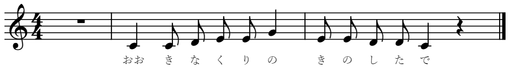
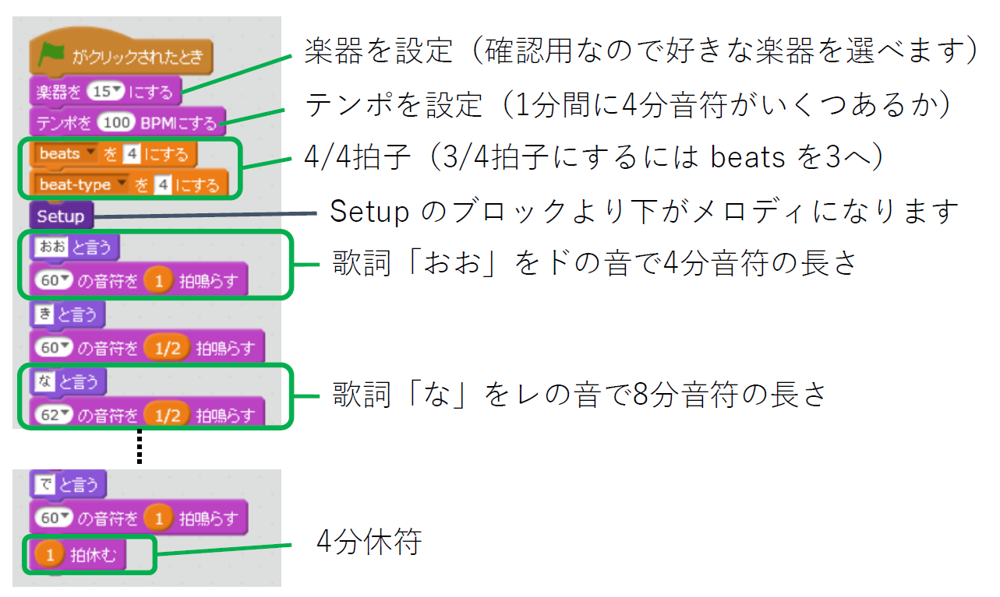
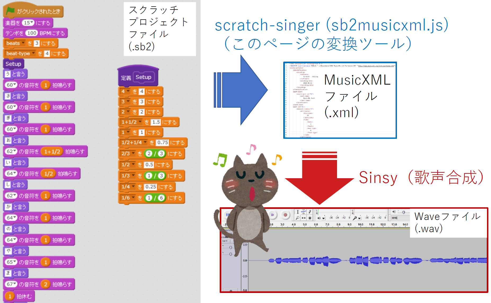
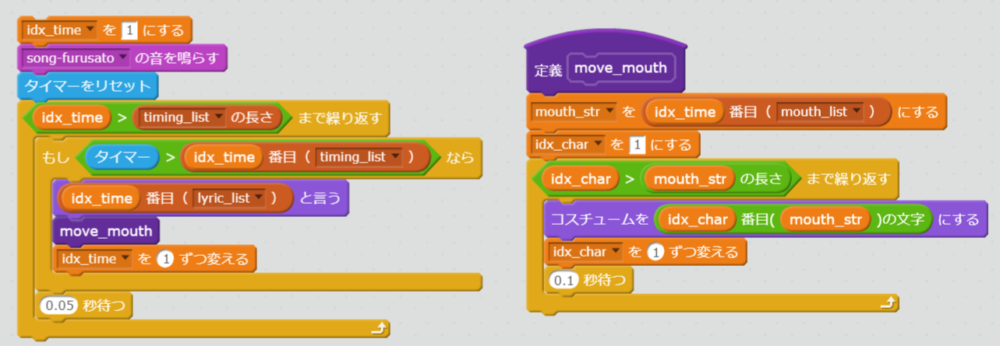

[(English)](index-en.md)

# スクラッチのプロジェクトファイルを歌声合成の入力ファイルに変換する

<label for="infile" class="button">
    スクラッチプロジェクト(.sb2)をアップロード <svg class="icon"><use xlink:href="symbol-defs.svg#icon-upload"></use></svg>
    <input type="file" id="infile" name="f">
</label>
<input type="text" id="filename" placeholder="" readonly>

    
<b>変換成功！</b>

    <ol>
        <li><a href="#" id="dl-xml" class="button">MusicXMLファイルをダウンロード (song.xml)  <svg class="icon"><use xlink:href="symbol-defs.svg#icon-download"></use></svg></a></li>
        <li><a href="http://www.sinsy.jp/" target="_blank">Sinsyのページを開く <svg class="icon"><use xlink:href="symbol-defs.svg#icon-new-tab"></use></svg></a></li>
        <li>タイミング・歌詞・リップシンク情報（スクラッチの「リスト」用） 
        <a href="#" id="dl-timing" class="button">song-timing.txt <svg class="icon"><use xlink:href="symbol-defs.svg#icon-download"></use></svg></a>
        <a href="#" id="dl-lyric" class="button">song-lyric.txt <svg class="icon"><use xlink:href="symbol-defs.svg#icon-download"></use></svg></a>
        <a href="#" id="dl-mouth" class="button">song-mouth.txt <svg class="icon"><use xlink:href="symbol-defs.svg#icon-download"></use></svg></a></li>        
    </ol>

## なにをするスクリプト？

- スクラッチのプロジェクトファイル (.sb2) を MusicXML (song.xml) へ変換します。
- MusicXML ファイルは [Sinsy (Singing Voice Synthesis)](http://www.sinsy.jp/) などの歌声合成ツールの入力に使えます。
- デモ
    1. [元のスクラッチプロジェクト (song-furusato.sb2)](sb2/song-furusato.sb2) <a href="https://scratch.mit.edu/projects/239680094/" target="_blank">（オンラインエディタで開く<svg class="icon"><use xlink:href="symbol-defs.svg#icon-new-tab"></use></svg>）</a>
    1. [変換して出来た MusicXML (song.xml)](test/song.xml)
    1. [Sinsyによる歌声合成結果のWAVファイル (song-furusato.wav) <svg class="icon"><use xlink:href="symbol-defs.svg#icon-music"></use></svg>](test/song-furusato.wav)（実際に聴けます）
    
## 使い方

「大きな栗の木の下で」のボーカルを作ってみます。

ここでは下のような楽譜で歌ってもらいます。第二小節以降をスクラッチでプログラムしていきます。はじめの音符が休符でない場合は、全休符の小節がはじめに追加されます。

### Step 1. スクラッチのプロジェクトファイル (.sb2)を用意

1. まずスクラッチで歌詞とメロディをプログラムします。 <a href="https://scratch.mit.edu/projects/240260846/" target="_blank">このスクラッチプロジェクト<svg class="icon"><use xlink:href="symbol-defs.svg#icon-new-tab"></use></svg></a> をもとに作ってみてください。
    - **「song」という名前のスプライトにプログラムを書いていきます。**
    - 「・・と言う」と「・・の音符を・・拍鳴らす」のブロックをセットにして使います。
    - 「・・拍休む」が休符になります。
    - 歌詞はひらがな、音符の長さはすでにある変数を使います。ひらがなは音に合わせます。（例：「今日は」は「きょうわ」）
    - 音符が小節をまたがないようにしてください。
    - 詳しくはリンク先プロジェクトの「使い方」を見てください。
1. [ファイル] > [手元のコンピュータにダウンロード] からスクラッチのプロジェクトをsb2ファイルとしてダウンロードします。
    - sb2ファイルをダウンロード後にスクラッチのオフラインエディタを使うこともできます。

### Step 2. スクラッチのプロジェクトファイル (.sb2) を MusicXML (.xml) へ変換

1. [このページの上のほうにあるボタン](#uploadfile)を押して、作成したスクラッチのプロジェクトファイル（sb2という拡張子）をアップロードします。
1. うまくいくとダウンロードリンクが表示されるので、そこから変換されて出来たMusicXMLファイル（song.xml）をダウンロードします。
    - **歌の一番はじめが休符でない場合は、冒頭に全休符の小節を自動的に加えます。**

### Step 3. MusicXML (.xml) を Sinsy へ入力して歌声合成

1. ダウンロードしたsong.xmlファイルを[Sinsy (Singing Voice Synthesis)
](http://www.sinsy.jp/)にアップロードします。「楽譜 (.xml)」にあるボタンを押すとアップロード画面が開きます。
    - ボーカルを選べます。「f000001j_dnn_beta」がよい感じです。
1. 歌声をWAVファイルなどで聞いたりダウンロードできます。

### 練習

- <a href="https://scratch.mit.edu/projects/242273933/" target="_blank">ここからハッピバースデーの曲のスクリプト<svg class="icon"><use xlink:href="symbol-defs.svg#icon-new-tab"></use></svg></a>を見ることができるので、名前に合わせて歌詞やメロディ（リズム）を変えてみましょう！

### 発展編：再びスクラッチへ～リップシンク（口パク）や歌詞の表示

<a href="https://scratch.mit.edu/projects/242273933/" target="_blank">こんな感じ（サンプルプロジェクト）<svg class="icon"><use xlink:href="symbol-defs.svg#icon-new-tab"></use></svg></a>でリップシンクして歌っている感じを出します。

1. Step 2 で、MusicXMLと一緒に生成された song-timing.txt, song-lyric.txt, song-mouth.txt をダウンロードしておきます。
1. 新たにスクラッチでプロジェクトを作り、歌わせたいスプライトに「a」、「i」、「u」、「e」、「o」、「m」という名前のコスチュームを用意し、口の形を変えておきます。
    - 歌詞に「ん」が良く出てくるなら「n」も用意してください。「e」と同じでもよいです。
    - サンプルプロジェクトのコスチュームも参考にしてください。
1. 音のタブで「ファイルから新しい音をアップロード」を選び、Step 3 でダウンロードした WAVファイルを読み込みます。
1. スクリプトのタブを開き、「データ」>「リストを作る」を使って、リストを3つ用意します。
    - 名前はなんでもよいですが、この例では timing-list, lyric-list, mouth-list にしておきます。それぞれのリストへ song-timing.txt, song-lyric.txt, song-mouth.txt を読み込みます。
    - 画面に表示されたリストの上で右クリック（もしくは二つ指クリック）をするとファイルからの読み込みができます。
    - timing-list には、何秒後に次の言葉に移るかが書かれています。
1. 「データ」>「変数を作る」でリストを順にみるための変数を作っておきます。この例では idx_time にします。はじめは1にしておきます。
1. スクリプトに「音」>「...の音を鳴らす」のブロックを置き、その直後に「調べる」>「タイマーをリセット」を置きます。以上で準備は完了です。
1. あとは、「調べる」>「タイマー」を使って、タイマー（経過時間）と timing_list の idx_time番目とをループで比べながら、もし時間が来たら idx_time を1つ増やして次に進めます。下の図の左側のような流れになります。
1. 今歌っている歌詞は lyric_list、口の形は mouth_list のそれぞれ idx_time番目から取り出せます。
    - mouth_list から取り出した文字に合わせてコスチューム変えることで口を動かします。
    - 口の動きは、一つの音に二つ以上の文字が入ることや、一つの文字が二つの口の形に対応したり（「ま」は m と a など）するので、mouth_list から取り出した文字の列を順に調べる必要があります。右側の move_mouth のように、「その他」>「ブロックを作る」で新たにブロックを作っておくと便利です。
    - あとはサンプルをよく確認して、流れを追ってみてください。開始時のずれをなくすように一度音を読み込んでおいたり、歌詞のいらない記号を表示しないようにもしています。

## Sinsyと組み合わせた合成例

1. [test/song-homesweethome.wav <svg class="icon"><use xlink:href="symbol-defs.svg#icon-music"></use></svg>](test/song-homesweethome.wav)
    - <a href="https://scratch.mit.edu/projects/239680350/" target="_blank">元のスクラッチプロジェクト（オンライン<svg class="icon"><use xlink:href="symbol-defs.svg#icon-new-tab"></use></svg></a>）
    - [元のスクラッチプロジェクト（sb2ファイル）](sb2/song-homesweethome.sb2)
1. [test/song-furusato.wav <svg class="icon"><use xlink:href="symbol-defs.svg#icon-music"></use></svg>](test/song-furusato.wav)
    - <a href="https://scratch.mit.edu/projects/239680094/" target="_blank">元のスクラッチプロジェクト（オンライン<svg class="icon"><use xlink:href="symbol-defs.svg#icon-new-tab"></use></svg></a>）
    - [元のスクラッチプロジェクト（sb2ファイル）](sb2/song-furusato.sb2)
1. <a href="https://scratch.mit.edu/projects/239682309/" target="_blank">「埴生の宿」を歌ってみます（スクラッチオンライン）<svg class="icon"><use xlink:href="symbol-defs.svg#icon-new-tab"></use></svg></a>
    - 合成された歌声を合わせて同時に再生しています。一回目は再生が遅れることがありますが、その場合はいったん止めてもう一度再生してみてください。
        - スプライト「song」は、歌声合成用のスクリプトが元になっています。
    - 作成した曲が長いとスクラッチのスクリプトの方が遅れてくるため、同期させるのであればスクラッチスクリプト内でタイマーを使ったほうがよいでしょう。
        - スプライト「Giga」の方はタイマーを使用した例です。詳しくは上の「発展編」を確認してください。
    - 口の動き（リップシンク、口パク）も行っています。
1. <a href="https://scratch.mit.edu/projects/243942031/" target="_blank">「ふるさと」を歌ってみます（スクラッチオンライン）<svg class="icon"><use xlink:href="symbol-defs.svg#icon-new-tab"></use></svg></a>
    - スプライト「song」の beginning-silent-duration は、自動挿入された全休符の一小節分の時間が入っているので、これで再生タイミングを合わせます。
    - スプライト「song」は特に音符が多いところでずれてきますが、「Giga」はずれがなく、リップシンクもうまくいっています。
    - 「Giga」単体で歌わせるには、「song」の「タイマーをリセット」の直後を切り離します。もしくは「・・・の音を鳴らす」と「タイマーをリセット」をGigaの方に移してもよいです。
1. <a href="https://scratch.mit.edu/projects/242364573/" target="_blank">「ハッピバースデー」を4人で歌ってみます（スクラッチオンライン）<svg class="icon"><use xlink:href="symbol-defs.svg#icon-new-tab"></use></svg></a>
    - スプライト「Conductor」は表示されていませんが、他のスプライトに歌詞の表示や口を動かすタイミングをメッセージで伝えています。
    - 変数「motion_offset」でやや口の動きを早めのタイミングにしているので、早すぎる場合はこれを減らします（0.2や0.1など）。
    - <a href="https://scratch.mit.edu/projects/242273933/" target="_blank">歌声合成のためのスクリプトはこちら<svg class="icon"><use xlink:href="symbol-defs.svg#icon-new-tab"></use></svg>です。
    - これをさらに [seq2sprite](https://memakura.github.io/seq2sprite/) と組み合わせると、<a href="https://scratch.mit.edu/projects/243360901/" target="_blank">こんな感じに応用できて<svg class="icon"><use xlink:href="symbol-defs.svg#icon-new-tab"></use></svg></a>、ケーキのろうそくを消す部分も加えることができます。

## TODO

- スクラッチ3のプロジェクトファイル (sb3) のサポート

## ローカルで動かすのに必要なファイル

ネットワークにつながっていないときに使うには、[Download Zip](https://github.com/memakura/scratch-singer/zipball/master)から Zipをダウンロード・展開し、以下のファイルを同じフォルダに入れておきます．

- sb2musicxml.html
- sb2musicxml.js
- jszip.min.js

## ライセンス

- MITライセンス
- jszip.min.js は https://stuk.github.io/jszip/ を利用しています。

